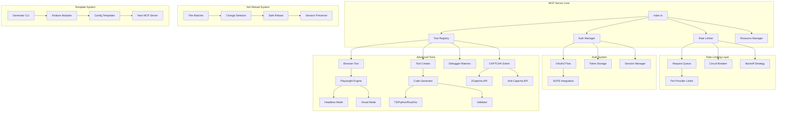

# MCP Server Expansion Architecture

## 🎯 Vision

Transform SecureLLM Bridge MCP Server into a **production-grade, extensible platform** that serves as the **template for all future MCP servers** in the NixOS workflow.

## 📋 Core Requirements

### 1. **Intelligent Rate Limiting & Error Handling**
**Problem**: APIs with strict rate limits cause retry loops when tools fail
**Solution**: Multi-layer rate limiting with exponential backoff and circuit breakers

### 2. **OAuth Authentication**
**Problem**: Server exposure risks (DNS rebind attacks)
**Solution**: OAuth2 flow for secure, manual authentication (Claude Desktop, etc)

### 3. **Browser Automation**
**Problem**: Need web scraping/interaction capabilities
**Solution**: Playwright-based tool with headless default + visual toggle

### 4. **Tool Creator/Debugger Maestro**
**Problem**: Creating new MCP tools is manual and error-prone
**Solution**: Meta-tool that generates validated tools in multiple languages

### 5. **CAPTCHA Solving**
**Problem**: Automated web tasks blocked by CAPTCHAs
**Solution**: Integration with 2Captcha/Anti-Captcha services

### 6. **Hot Reload**
**Problem**: Development requires server restarts
**Solution**: Watch-mode with safe hot reload (preserves active sessions)

### 7. **Template System**
**Problem**: Each new MCP server requires full boilerplate
**Solution**: Modular template system with pluggable features

---

## 🏗️ Architecture Overview



---

## 📦 Phase 1: Core Infrastructure

### 1.1 Rate Limiting System

**Location**: `src/middleware/rate-limiter.ts`

```typescript
interface RateLimitConfig {
  provider: string;
  requestsPerMinute: number;
  burstSize: number;
  retryStrategy: 'exponential' | 'linear' | 'fibonacci';
  maxRetries: number;
  circuitBreaker: {
    failureThreshold: number;
    resetTimeout: number;
  };
}

class SmartRateLimiter {
  private queues: Map<string, RequestQueue>;
  private circuitBreakers: Map<string, CircuitBreaker>;
  
  async execute<T>(
    provider: string,
    fn: () => Promise<T>
  ): Promise<T>;
  
  private shouldRetry(error: Error, attempt: number): boolean;
  private calculateBackoff(attempt: number): number;
}
```

**Features**:
- Per-provider request queuing
- Circuit breaker pattern (fail-fast after threshold)
- Exponential backoff with jitter
- Prevents retry loops by tracking failure patterns
- Metrics collection (success rate, latency, failures)

### 1.2 Enhanced Error Handling

**Location**: `src/middleware/error-handler.ts`

```typescript
interface ErrorContext {
  tool: string;
  provider?: string;
  attempt: number;
  timestamp: number;
  metadata?: Record<string, any>;
}

class ErrorHandler {
  // Classifies errors: transient vs permanent
  classifyError(error: Error): 'transient' | 'permanent' | 'rate_limit';
  
  // Provides user-friendly messages
  formatError(error: Error, context: ErrorContext): string;
  
  // Logs to knowledge DB for analysis
  logError(error: Error, context: ErrorContext): void;
}
```

---

## 🔐 Phase 2: OAuth Authentication System

### 2.1 OAuth2 Flow

**Location**: `src/auth/oauth-manager.ts`

**Supported Providers**:
- Custom (Claude Desktop, internal services)
- GitHub
- Google
- GitLab

**Flow**:
1. User initiates auth via tool call
2. Server generates authorization URL
3. User completes OAuth in browser (manual)
4. Server exchanges code for tokens
5. Tokens stored in SOPS-encrypted secrets

```typescript
interface OAuthConfig {
  provider: string;
  clientId: string;        // From SOPS
  clientSecret: string;    // From SOPS
  redirectUri: string;
  scopes: string[];
}

class OAuthManager {
  // Step 1: Generate auth URL
  getAuthorizationUrl(provider: string): string;
  
  // Step 2: Exchange code for token
  async exchangeCodeForToken(
    provider: string,
    code: string
  ): Promise<OAuthToken>;
  
  // Step 3: Store securely
  async storeToken(provider: string, token: OAuthToken): Promise<void>;
  
  // Refresh tokens automatically
  async refreshToken(provider: string): Promise<OAuthToken>;
}
```

**MCP Tool**:
```typescript
{
  name: "oauth_authenticate",
  description: "Initiate OAuth authentication for a service",
  inputSchema: {
    provider: "github | google | gitlab | custom",
    scopes: ["read:user", "repo"]
  }
}
```

### 2.2 Session Security

- Tokens encrypted with SOPS (AGE key)
- Session timeout (configurable)
- Token rotation
- Audit logging of auth events

---

## 🌐 Phase 3: Browser Automation Tool

### 3.1 Playwright Integration

**Location**: `src/tools/browser-automation.ts`

**Dependencies**:
```json
{
  "playwright": "^1.40.0",
  "@playwright/test": "^1.40.0"
}
```

**Architecture**:
```typescript
interface BrowserSession {
  id: string;
  browser: Browser;
  context: BrowserContext;
  mode: 'headless' | 'headed';
  captchaSolver?: CaptchaSolver;
}

class BrowserAutomation {
  private sessions: Map<string, BrowserSession>;
  
  // Session management
  async createSession(mode: 'headless' | 'headed'): Promise<string>;
  async closeSession(sessionId: string): Promise<void>;
  
  // Navigation
  async navigate(sessionId: string, url: string): Promise<void>;
  
  // Interaction
  async click(sessionId: string, selector: string): Promise<void>;
  async type(sessionId: string, selector: string, text: string): Promise<void>;
  async extract(sessionId: string, selector: string): Promise<string>;
  
  // Advanced
  async screenshot(sessionId: string): Promise<Buffer>;
  async executeScript(sessionId: string, script: string): Promise<any>;
  
  // CAPTCHA handling
  async solveCaptcha(sessionId: string, type: string): Promise<void>;
}
```

**MCP Tools**:
```typescript
[
  {
    name: "browser_create_session",
    description: "Create a new browser automation session",
    inputSchema: {
      mode: "headless | headed",
      viewport: { width: 1920, height: 1080 }
    }
  },
  {
    name: "browser_navigate",
    description: "Navigate to URL in browser session",
    inputSchema: {
      session_id: "string",
      url: "string"
    }
  },
  {
    name: "browser_interact",
    description: "Interact with page elements",
    inputSchema: {
      session_id: "string",
      action: "click | type | extract",
      selector: "string",
      value: "string (optional)"
    }
  },
  {
    name: "browser_screenshot",
    description: "Capture screenshot of current page",
    inputSchema: {
      session_id: "string",
      full_page: "boolean"
    }
  },
  {
    name: "browser_close_session",
    description: "Close browser session and cleanup",
    inputSchema: {
      session_id: "string"
    }
  }
]
```

**Features**:
- Persistent browser contexts (cookies, localStorage)
- Stealth mode (evade bot detection)
- Request/response interception
- Network throttling simulation
- Mobile device emulation

---

## 🛠️ Phase 4: Tool Creator/Debugger Maestro

### 4.1 Meta-Tool for Tool Generation

**Location**: `src/tools/tool-creator.ts`

**Concept**: AI-assisted tool that generates new MCP tools based on specifications.

```typescript
interface ToolSpec {
  name: string;
  description: string;
  language: 'typescript' | 'python' | 'rust' | 'go';
  inputSchema: object;
  implementation: string; // Natural language description
  validation?: string;    // Validation logic
  tests?: string[];       // Test cases
}

class ToolCreator {
  // Generate tool skeleton
  async generateTool(spec: ToolSpec): Promise<GeneratedTool>;
  
  // Validate generated code
  async validateTool(tool: GeneratedTool): Promise<ValidationResult>;
  
  // Register tool dynamically
  async registerTool(tool: GeneratedTool): Promise<void>;
  
  // Run tests
  async testTool(tool: GeneratedTool): Promise<TestResult>;
}
```

**MCP Tool**:
```typescript
{
  name: "create_mcp_tool",
  description: "Generate a new MCP tool from specification",
  inputSchema: {
    name: "string",
    description: "string",
    language: "typescript | python | rust | go",
    input_schema: "object",
    implementation: "string (natural language)",
    auto_validate: "boolean",
    auto_test: "boolean"
  }
}
```

**Workflow**:
1. User provides spec in natural language
2. Tool Creator generates code using LLM
3. Code is validated (syntax, schema, security)
4. Tests are generated and executed
5. Tool is registered and made available
6. Hot reload applies changes without restart

### 4.2 Debugger Maestro

**Location**: `src/tools/debugger-maestro.ts`

**Purpose**: Debug and analyze MCP tool execution

```typescript
interface DebugSession {
  toolName: string;
  breakpoints: Breakpoint[];
  watchedVars: string[];
  callStack: StackFrame[];
}

class DebuggerMaestro {
  // Start debug session
  async startDebug(toolName: string): Promise<string>;
  
  // Step through execution
  async step(sessionId: string, mode: 'in' | 'over' | 'out'): Promise<void>;
  
  // Inspect state
  async inspect(sessionId: string, variable: string): Promise<any>;
  
  // Evaluate expressions
  async evaluate(sessionId: string, expression: string): Promise<any>;
  
  // Performance profiling
  async profile(toolName: string, args: any): Promise<ProfileResult>;
}
```

**MCP Tools**:
```typescript
[
  {
    name: "debug_tool",
    description: "Debug MCP tool execution step-by-step",
    inputSchema: {
      tool_name: "string",
      args: "object",
      breakpoints: "string[] (line numbers or function names)"
    }
  },
  {
    name: "profile_tool",
    description: "Profile tool performance and identify bottlenecks",
    inputSchema: {
      tool_name: "string",
      args: "object",
      iterations: "number (default: 10)"
    }
  },
  {
    name: "validate_tool",
    description: "Validate tool implementation against schema",
    inputSchema: {
      tool_name: "string"
    }
  }
]
```

---

## 🤖 Phase 5: CAPTCHA Solving Integration

### 5.1 CAPTCHA Services

**Location**: `src/services/captcha-solver.ts`

**Supported Services**:
- 2Captcha (recommended)
- Anti-Captcha
- CapSolver

```typescript
interface CaptchaConfig {
  service: '2captcha' | 'anticaptcha' | 'capsolver';
  apiKey: string; // From SOPS
  timeout: number;
  retries: number;
}

interface CaptchaTask {
  type: 'image' | 'recaptcha_v2' | 'recaptcha_v3' | 'hcaptcha';
  sitekey?: string;
  pageUrl?: string;
  imageBase64?: string;
}

class CaptchaSolver {
  // Submit CAPTCHA for solving
  async solve(task: CaptchaTask): Promise<string>;
  
  // Check balance
  async getBalance(): Promise<number>;
  
  // Report incorrect solution
  async reportBad(taskId: string): Promise<void>;
}
```

**Integration with Browser Tool**:
```typescript
// Auto-detect and solve CAPTCHAs during browser automation
async navigate(url: string) {
  await page.goto(url);
  
  // Check for CAPTCHA
  const hasCaptcha = await this.detectCaptcha(page);
  if (hasCaptcha) {
    const solution = await this.captchaSolver.solve({
      type: 'recaptcha_v2',
      sitekey: await this.extractSitekey(page),
      pageUrl: url
    });
    await this.submitCaptchaSolution(page, solution);
  }
}
```

**MCP Tool**:
```typescript
{
  name: "solve_captcha",
  description: "Solve CAPTCHA using third-party service",
  inputSchema: {
    type: "image | recaptcha_v2 | recaptcha_v3 | hcaptcha",
    sitekey: "string (optional)",
    page_url: "string (optional)",
    image_base64: "string (optional)"
  }
}
```

**Cost Tracking**:
- Track CAPTCHA solving costs
- Report to metrics
- Budget limits

---

## 🔄 Phase 6: Hot Reload System

### 6.1 File Watcher

**Location**: `src/dev/hot-reload.ts`

```typescript
interface WatchConfig {
  paths: string[];
  ignore: string[];
  debounceMs: number;
}

class HotReloader {
  private watcher: FSWatcher;
  private reloadInProgress: boolean;
  
  // Start watching files
  async start(config: WatchConfig): Promise<void>;
  
  // Handle file changes
  private async handleChange(path: string): Promise<void>;
  
  // Reload specific module
  private async reloadModule(modulePath: string): Promise<void>;
  
  // Preserve active sessions
  private async preserveSessions(): Promise<SessionState>;
  private async restoreSessions(state: SessionState): Promise<void>;
}
```

**Features**:
- Watch `src/` directory for changes
- Debounce rapid changes (500ms)
- Reload only changed modules
- Preserve:
  - Active browser sessions
  - OAuth tokens
  - Knowledge DB connections
  - Rate limiter state
- Transaction-safe reloads
- Rollback on error

**Environment Variable**:
```bash
HOT_RELOAD=true  # Enable in development
HOT_RELOAD=false # Disable in production
```

---

## 📦 Phase 7: Template System

### 7.1 MCP Server Generator

**Location**: `templates/mcp-server/`

**CLI Tool**: `create-mcp-server`

```bash
# Interactive mode
npx create-mcp-server

# CLI mode
npx create-mcp-server \
  --name my-server \
  --features auth,browser,captcha \
  --language typescript \
  --output ./my-server
```

**Template Structure**:
```
templates/mcp-server/
├── base/                    # Core boilerplate
│   ├── src/
│   │   ├── index.ts        # Main entry
│   │   ├── types/          # Type definitions
│   │   └── utils/          # Utilities
│   ├── package.json
│   ├── tsconfig.json
│   └── README.md
├── features/               # Optional features
│   ├── auth/              # OAuth system
│   ├── rate-limiting/     # Rate limiter
│   ├── browser/           # Playwright
│   ├── captcha/           # CAPTCHA solver
│   ├── knowledge/         # Knowledge DB
│   ├── hot-reload/        # Dev hot reload
│   └── tool-creator/      # Meta-tool
└── examples/              # Example servers
    ├── web-scraper/
    ├── api-client/
    └── data-processor/
```

**Generator Class**:
```typescript
interface ServerConfig {
  name: string;
  features: Feature[];
  language: 'typescript' | 'python';
  packageManager: 'npm' | 'pnpm' | 'yarn';
}

class ServerGenerator {
  // Generate new server
  async generate(config: ServerConfig): Promise<void>;
  
  // Add feature to existing server
  async addFeature(
    serverPath: string,
    feature: Feature
  ): Promise<void>;
  
  // Validate server structure
  async validate(serverPath: string): Promise<ValidationResult>;
}
```

### 7.2 Feature Modules

Each feature is self-contained:
```
features/auth/
├── src/
│   ├── oauth-manager.ts
│   ├── token-storage.ts
│   └── types.ts
├── docs/
│   ├── README.md
│   └── examples.md
├── tests/
│   └── oauth-manager.test.ts
├── config.json          # Feature metadata
└── install.sh           # Setup script
```

**Feature Config**:
```json
{
  "name": "auth",
  "version": "1.0.0",
  "dependencies": {
    "npm": ["passport", "passport-oauth2"],
    "system": []
  },
  "envVars": [
    "OAUTH_CLIENT_ID",
    "OAUTH_CLIENT_SECRET"
  ],
  "files": [
    "src/auth/oauth-manager.ts",
    "src/auth/token-storage.ts"
  ],
  "integration": {
    "index.ts": {
      "imports": ["import { OAuthManager } from './auth/oauth-manager.js';"],
      "constructor": ["this.oauth = new OAuthManager();"],
      "tools": ["...oauthTools"]
    }
  }
}
```

---

## 📊 Implementation Phases

### Phase 1: Core Infrastructure (Week 1)
- [X] Implement `SmartRateLimiter` with circuit breaker
- [X] Enhanced `ErrorHandler` with classification
- [X] Rate limit configuration per provider
- [X] Metrics collection and reporting
- [X] Integration tests for retry logic

### Phase 2: OAuth System (Week 1-2)
- [X] `OAuthManager` base implementation
- [X] GitHub provider support
- [ ] Token storage with SOPS
- [ ] Session management
- [ ] MCP tool: `oauth_authenticate`
- [ ] Documentation and examples

### Phase 3: Browser Automation (Week 2-3)
- [ ] Playwright integration
- [ ] `BrowserAutomation` class
- [ ] Session management
- [ ] Headless/headed toggle
- [ ] MCP tools (create, navigate, interact, screenshot, close)
- [ ] Stealth mode configuration

### Phase 4: Tool Creator (Week 3-4)
- [ ] `ToolCreator` base implementation
- [ ] Code generation using LLM
- [ ] Validation pipeline
- [ ] Test generation
- [ ] Dynamic tool registration
- [ ] `DebuggerMaestro` for troubleshooting

### Phase 5: CAPTCHA Solving (Week 4)
- [ ] `CaptchaSolver` implementation
- [ ] 2Captcha integration
- [ ] Browser tool integration
- [ ] Cost tracking
- [ ] MCP tool: `solve_captcha`

### Phase 6: Hot Reload (Week 4-5)
- [ ] File watcher implementation
- [ ] Safe module reloading
- [ ] Session preservation
- [ ] Rollback mechanism
- [ ] Development mode toggle

### Phase 7: Template System (Week 5-6)
- [ ] Base template structure
- [ ] Feature modules extraction
- [ ] Generator CLI tool
- [ ] Documentation
- [ ] Example servers

---

## 🔒 Security Considerations

### Rate Limiting
- Prevent abuse of expensive operations (browser, CAPTCHA)
- Per-user quotas (if multi-user)
- Cost tracking for CAPTCHA services

### OAuth
- Tokens encrypted with SOPS
- Token rotation
- Session expiration
- Audit logging

### Browser Automation
- Sandbox Playwright processes
- Network request filtering
- Resource limits (memory, CPU)
- Disable file downloads by default

### Tool Creator
- Code validation before execution
- Sandboxed test execution
- Security scanning (no hardcoded secrets, no dangerous operations)
- Manual approval for production

### CAPTCHA
- Budget limits
- Rate limiting CAPTCHA requests
- Fallback to manual solving

---

## 📈 Success Metrics

### Performance
- Tool execution time < 2s (p95)
- Rate limit violations < 1%
- Circuit breaker activations tracked
- CAPTCHA solve rate > 95%

### Reliability
- Uptime > 99.9%
- Error rate < 0.1%
- Successful hot reloads > 99%

### Developer Experience
- Tool creation time < 5 minutes
- Template server generation < 1 minute
- Hot reload latency < 500ms

### Cost
- CAPTCHA costs < $10/month
- Cloud costs (if applicable) < $50/month

---

## 🚀 Next Steps

1. **Review this architecture** with team
2. **Prioritize phases** based on immediate needs
3. **Setup development environment** (Playwright, CAPTCHA API keys)
4. **Create project board** for tracking
5. **Start Phase 1** implementation

---

**Document Version**: 1.0  
**Created**: 2025-11-06  
**Authors**: SecureLLM Bridge Team  
**Status**: 📋 Planning