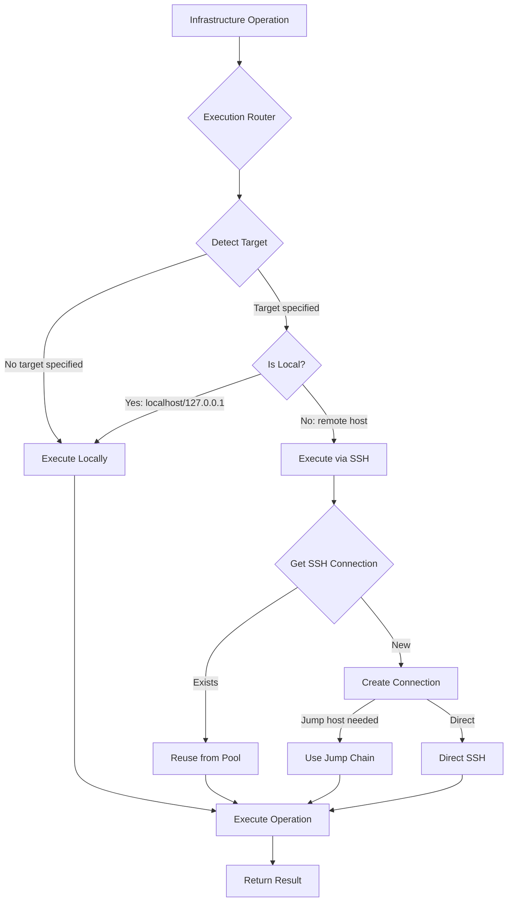

# Infrastructure Management Tools Architecture

## 📋 Executive Summary

This document outlines the architecture for advanced infrastructure management tools in the SecureLLM Bridge MCP server. These tools provide enterprise-grade capabilities for managing NFS/NAS storage, Kubernetes/Docker Swarm clusters, and multi-distro server development across NixOS, Ubuntu, and RHEL systems.

### Current State
- Existing SSH advanced tools with connection pooling, tunneling, and jump hosts
- MCP server foundation with security controls and audit logging
- Basic package management and system tools

### Target State
- **NFS Management**: Mount/export operations, health monitoring, performance tracking
- **NAS Management**: Volume/snapshot operations, protocol management (NFS/SMB)
- **Cluster Management**: Kubernetes + Docker Swarm orchestration, scaling, health checks
- **Server Development**: Multi-distro package/service management, automated provisioning

---

## 🏗️ Architecture Overview

```mermaid
graph TB
    MCP[MCP Server] --> Router[Execution Router]
    
    Router --> Local[Local Executor]
    Router --> Remote[Remote Executor]
    
    Remote --> SSHPool[SSH Connection Pool]
    Remote --> SSHTunnel[SSH Tunnels]
    Remote --> SSHJump[Jump Hosts]
    
    Local --> NFS[NFS Manager]
    Local --> NAS[NAS Manager]
    Local --> Cluster[Cluster Manager]
    Local --> Server[Server Manager]
    
    Remote --> NFS
    Remote --> NAS
    Remote --> Cluster
    Remote --> Server
    
    NFS --> NFSMount[Mount/Unmount]
    NFS --> NFSExport[Export Management]
    NFS --> NFSHealth[Health Monitoring]
    NFS --> NFSPerf[Performance Metrics]
    
    NAS --> NASVol[Volume Lifecycle]
    NAS --> NASSnap[Snapshot Management]
    NAS --> NASProto[NFS/SMB Protocols]
    NAS --> NASQuota[Quota Management]
    
    Cluster --> K8s[Kubernetes Orchestrator]
    Cluster --> Swarm[Docker Swarm Manager]
    Cluster --> ClusterHealth[Health Monitoring]
    Cluster --> ClusterScale[Scaling Operations]
    
    Server --> ServerPkg[Package Management]
    Server --> ServerSvc[Service Management]
    Server --> ServerFW[Firewall Config]
    Server --> ServerCfg[Configuration]
```



---

## 🔐 Security Model

### Hybrid Execution Security

**Execution Context**:
```typescript
interface ExecutionContext {
  mode: 'local' | 'remote';
  target?: string;           // hostname for remote operations
  ssh_connection_id?: string; // if remote mode
  sudo_required?: boolean;
  user: string;
  distro?: 'nixos' | 'ubuntu' | 'rhel';
}
```

### Security Layers

1. **Execution Mode Detection**
   - Auto-detect local vs remote targets
   - Validate target accessibility
   - Choose optimal execution path

2. **Command Whitelisting**
   - Module-specific command whitelist
   - Distro-specific variations
   - Sudo-elevated operations explicitly flagged

3. **SSH Integration Security**
   - Reuse established SSH connection pool
   - Leverage existing jump host chains
   - Maintain SSH audit logging

4. **Input Validation**
   - Strict schema validation for all operations
   - Path sanitization and validation
   - Command injection prevention

5. **Privilege Management**
   - Explicit sudo elevation requests
   - Role-based operation access
   - Audit logging of privileged operations

### Security Controls

- **Host Whitelisting**: Extend SSH whitelist for infrastructure targets
- **Command Sanitization**: Module-aware input validation
- **Rate Limiting**: Per-module operation throttling
- **Audit Logging**: All operations logged with full context
- **Transaction Support**: Rollback capability for critical operations
- **Health Checks**: Continuous monitoring and alerting

---

## 🔧 Component Design

### 1. Execution Router

**Location**: `src/tools/infrastructure/execution-router.ts`

**Responsibilities**:
- Route operations to local or remote executors
- Detect target location (local vs remote)
- Manage SSH connection lifecycle
- Handle execution context

**Key Methods**:
```typescript
class ExecutionRouter {
  // Route operation to appropriate executor
  async route(operation: InfraOperation, context: ExecutionContext): Promise<OperationResult>
  
  // Detect if target is local
  async isLocalTarget(target?: string): Promise<boolean>
  
  // Get or create remote execution context
  async getRemoteContext(target: string): Promise<RemoteContext>
  
  // Execute locally
  async executeLocal(operation: InfraOperation): Promise<OperationResult>
  
  // Execute remotely via SSH
  async executeRemote(operation: InfraOperation, conn: SSHConnection): Promise<OperationResult>
}
```

**Execution Decision Flow**:


---

### 2. NFS Manager

**Location**: `src/tools/infrastructure/nfs/nfs-manager.ts`

**Responsibilities**:
- NFS mount/unmount operations
- Export configuration management
- Health monitoring and diagnostics
- Performance metrics collection

**Features**:

**Mount Management**:
```typescript
interface NFSMountConfig {
  source: string;           // server:/export/path
  target: string;           // /mnt/nfs/mountpoint
  version: '3' | '4' | '4.1' | '4.2';
  options?: string[];       // mount options (rw, async, etc.)
  auto_mount?: boolean;     // add to fstab
  verify_mount?: boolean;   // verify after mounting
}

class NFSManager {
  // Mount NFS share
  async mount(config: NFSMountConfig, context: ExecutionContext): Promise<NFSMountResult>
  
  // Unmount NFS share
  async unmount(target: string, context: ExecutionContext): Promise<Result>
  
  // List active mounts
  async listMounts(context: ExecutionContext): Promise<NFSMount[]>
  
  // Check mount health
  async checkHealth(target: string, context: ExecutionContext): Promise<NFSHealthStatus>
  
  // Get performance metrics
  async getMetrics(target: string, context: ExecutionContext): Promise<NFSMetrics>
}
```

**Export Management**:
```typescript
interface NFSExportConfig {
  path: string;             // /export/data
  clients: string[];        // ['10.0.0.0/24', 'client.example.com']
  options: string[];        // ['rw', 'sync', 'no_subtree_check']
  security?: 'sys' | 'krb5' | 'krb5i' | 'krb5p';
}

class NFSExportManager {
  // Add NFS export
  async addExport(config: NFSExportConfig, context: ExecutionContext): Promise<Result>
  
  // Remove NFS export
  async removeExport(path: string, context: ExecutionContext): Promise<Result>
  
  // List exports
  async listExports(context: ExecutionContext): Promise<NFSExport[]>
  
  // Reload exports
  async reloadExports(context: ExecutionContext): Promise<Result>
  
  // Validate export configuration
  async validateExport(config: NFSExportConfig): Promise<ValidationResult>
}
```

**Health Monitoring**:
```typescript
interface NFSHealthStatus {
  mount_point: string;
  status: 'healthy' | 'degraded' | 'failed';
  server_reachable: boolean;
  mount_accessible: boolean;
  response_time_ms: number;
  last_check: Date;
  issues: string[];
  metrics: {
    read_iops: number;
    write_iops: number;
    latency_ms: number;
    throughput_mbps: number;
  };
}
```

---

### 3. NAS Manager

**Location**: `src/tools/infrastructure/nas/nas-manager.ts`

**Responsibilities**:
- Volume lifecycle management
- Snapshot operations
- Protocol management (NFS/SMB)
- Quota and replication

**Features**:

**Volume Management**:
```typescript
interface NASVolumeConfig {
  name: string;
  size_gb: number;
  pool?: string;
  filesystem?: 'ext4' | 'xfs' | 'btrfs' | 'zfs';
  compression?: boolean;
  deduplication?: boolean;
  encryption?: boolean;
}

class NASVolumeManager {
  // Create volume
  async createVolume(config: NASVolumeConfig, context: ExecutionContext): Promise<NASVolume>
  
  // Delete volume
  async deleteVolume(name: string, context: ExecutionContext): Promise<Result>
  
  // Resize volume
  async resizeVolume(name: string, new_size_gb: number, context: ExecutionContext): Promise<Result>
  
  // List volumes
  async listVolumes(context: ExecutionContext): Promise<NASVolume[]>
  
  // Get volume details
  async getVolume(name: string, context: ExecutionContext): Promise<NASVolumeDetails>
}
```

**Snapshot Management**:
```typescript
interface NASSnapshotConfig {
  volume: string;
  name: string;
  retention_days?: number;
  description?: string;
}

class NASSnapshotManager {
  // Create snapshot
  async createSnapshot(config: NASSnapshotConfig, context: ExecutionContext): Promise<NASSnapshot>
  
  // Delete snapshot
  async deleteSnapshot(volume: string, snapshot: string, context: ExecutionContext): Promise<Result>
  
  // List snapshots
  async listSnapshots(volume: string, context: ExecutionContext): Promise<NASSnapshot[]>
  
  // Restore snapshot
  async restoreSnapshot(volume: string, snapshot: string, context: ExecutionContext): Promise<Result>
  
  // Clone snapshot
  async cloneSnapshot(config: SnapshotCloneConfig, context: ExecutionContext): Promise<NASVolume>
}
```

**Protocol Management**:
```typescript
interface ProtocolConfig {
  type: 'nfs' | 'smb';
  volume: string;
  enabled: boolean;
  options?: Map<string, any>;
}

class NASProtocolManager {
  // Configure NFS share
  async configureNFS(config: NFSProtocolConfig, context: ExecutionContext): Promise<Result>
  
  // Configure SMB share
  async configureSMB(config: SMBProtocolConfig, context: ExecutionContext): Promise<Result>
  
  // List active shares
  async listShares(context: ExecutionContext): Promise<NASShare[]>
  
  // Enable/disable protocol
  async setProtocolState(volume: string, protocol: 'nfs' | 'smb', enabled: boolean, context: ExecutionContext): Promise<Result>
}
```

---

### 4. Cluster Manager

**Location**: `src/tools/infrastructure/cluster/cluster-manager.ts`

**Responsibilities**:
- Kubernetes cluster operations
- Docker Swarm management
- Node lifecycle management
- Health monitoring and scaling

**Orchestrator Abstraction**:
```typescript
interface ClusterOrchestrator {
  type: 'kubernetes' | 'docker_swarm';
  
  // Cluster operations
  getClusterInfo(): Promise<ClusterInfo>;
  getClusterHealth(): Promise<ClusterHealth>;
  
  // Node operations
  listNodes(): Promise<Node[]>;
  getNode(name: string): Promise<NodeDetails>;
  drainNode(name: string): Promise<Result>;
  
  // Workload operations
  listWorkloads(): Promise<Workload[]>;
  getWorkload(name: string): Promise<WorkloadDetails>;
  scaleWorkload(name: string, replicas: number): Promise<Result>;
  
  // Service operations
  listServices(): Promise<Service[]>;
  exposeService(config: ServiceConfig): Promise<Result>;
}
```

**Kubernetes Manager**:
```typescript
class KubernetesManager implements ClusterOrchestrator {
  type = 'kubernetes';
  
  // Cluster operations
  async getClusterInfo(): Promise<K8sClusterInfo>
  async getNodes(): Promise<K8sNode[]>
  async getNamespaces(): Promise<K8sNamespace[]>
  
  // Workload operations
  async listPods(namespace?: string): Promise<K8sPod[]>
  async getDeployment(name: string, namespace: string): Promise<K8sDeployment>
  async scaleDeployment(name: string, namespace: string, replicas: number): Promise<Result>
  async rolloutRestart(name: string, namespace: string): Promise<Result>
  
  // Service operations
  async listServices(namespace?: string): Promise<K8sService[]>
  async exposeDeployment(config: K8sServiceConfig): Promise<K8sService>
  
  // Config operations
  async listConfigMaps(namespace?: string): Promise<K8sConfigMap[]>
  async listSecrets(namespace?: string): Promise<K8sSecret[]>
  async createConfigMap(config: ConfigMapConfig): Promise<Result>
  
  // Health checks
  async checkHealth(): Promise<K8sHealthStatus>
  async getMetrics(): Promise<K8sMetrics>
  
  // Log operations
  async getLogs(pod: string, namespace: string, options?: LogOptions): Promise<string>
}
```

**Docker Swarm Manager**:
```typescript
class DockerSwarmManager implements ClusterOrchestrator {
  type = 'docker_swarm';
  
  // Cluster operations
  async getClusterInfo(): Promise<SwarmInfo>
  async getNodes(): Promise<SwarmNode[]>
  async joinNode(config: SwarmJoinConfig): Promise<Result>
  async leaveNode(node: string, force?: boolean): Promise<Result>
  
  // Service operations
  async listServices(): Promise<SwarmService[]>
  async createService(config: SwarmServiceConfig): Promise<SwarmService>
  async updateService(name: string, config: SwarmServiceUpdate): Promise<Result>
  async scaleService(name: string, replicas: number): Promise<Result>
  async removeService(name: string): Promise<Result>
  
  // Stack operations
  async deployStack(name: string, compose_file: string): Promise<Result>
  async removeStack(name: string): Promise<Result>
  async listStacks(): Promise<SwarmStack[]>
  
  // Network operations
  async listNetworks(): Promise<SwarmNetwork[]>
  async createNetwork(config: NetworkConfig): Promise<SwarmNetwork>
  
  // Volume operations
  async listVolumes(): Promise<SwarmVolume[]>
  async createVolume(config: VolumeConfig): Promise<SwarmVolume>
  
  // Health checks
  async checkHealth(): Promise<SwarmHealthStatus>
  async getMetrics(): Promise<SwarmMetrics>
}
```

**Unified Cluster Interface**:
```typescript
class ClusterManager {
  private orchestrators: Map<string, ClusterOrchestrator> = new Map();
  
  // Register orchestrator
  async registerOrchestrator(id: string, type: 'kubernetes' | 'docker_swarm', config: any): Promise<void>
  
  // Get orchestrator
  async getOrchestrator(id: string): Promise<ClusterOrchestrator>
  
  // List all clusters
  async listClusters(): Promise<ClusterSummary[]>
  
  // Health check all clusters
  async healthCheckAll(): Promise<Map<string, ClusterHealth>>
}
```

---

### 5. Server Manager

**Location**: `src/tools/infrastructure/server/server-manager.ts`

**Responsibilities**:
- Multi-distro package management
- Service lifecycle management
- Firewall configuration
- System configuration and provisioning

**Distro Abstraction Layer**:
```typescript
interface DistroAdapter {
  distro: 'nixos' | 'ubuntu' | 'rhel';
  
  // Package management
  installPackages(packages: string[]): Promise<Result>;
  removePackages(packages: string[]): Promise<Result>;
  updatePackages(): Promise<Result>;
  searchPackages(query: string): Promise<Package[]>;
  
  // Service management
  startService(name: string): Promise<Result>;
  stopService(name: string): Promise<Result>;
  restartService(name: string): Promise<Result>;
  enableService(name: string): Promise<Result>;
  disableService(name: string): Promise<Result>;
  getServiceStatus(name: string): Promise<ServiceStatus>;
  
  // Firewall management
  addFirewallRule(rule: FirewallRule): Promise<Result>;
  removeFirewallRule(rule: FirewallRule): Promise<Result>;
  listFirewallRules(): Promise<FirewallRule[]>;
  
  // System operations
  getSystemInfo(): Promise<SystemInfo>;
  reboot(delay_seconds?: number): Promise<Result>;
}
```

**NixOS Adapter**:
```typescript
class NixOSAdapter implements DistroAdapter {
  distro = 'nixos';
  
  async installPackages(packages: string[]): Promise<Result> {
    // Add to configuration.nix and rebuild
  }
  
  async removePackages(packages: string[]): Promise<Result> {
    // Remove from configuration.nix and rebuild
  }
  
  async updatePackages(): Promise<Result> {
    // nix-channel --update && nixos-rebuild switch
  }
  
  async searchPackages(query: string): Promise<Package[]> {
    // nix search
  }
  
  // Service management via systemd
  async startService(name: string): Promise<Result>
  async enableService(name: string): Promise<Result>
  
  // Firewall via NixOS firewall module
  async addFirewallRule(rule: FirewallRule): Promise<Result>
}
```

**Ubuntu/Debian Adapter**:
```typescript
class UbuntuAdapter implements DistroAdapter {
  distro = 'ubuntu';
  
  async installPackages(packages: string[]): Promise<Result> {
    // apt-get install
  }
  
  async removePackages(packages: string[]): Promise<Result> {
    // apt-get remove
  }
  
  async updatePackages(): Promise<Result> {
    // apt-get update && apt-get upgrade
  }
  
  // Service management via systemd
  async startService(name: string): Promise<Result>
  
  // Firewall via ufw
  async addFirewallRule(rule: FirewallRule): Promise<Result>
}
```

**RHEL Adapter**:
```typescript
class RHELAdapter implements DistroAdapter {
  distro = 'rhel';
  
  async installPackages(packages: string[]): Promise<Result> {
    // yum/dnf install
  }
  
  // Service management via systemd
  async startService(name: string): Promise<Result>
  
  // Firewall via firewalld
  async addFirewallRule(rule: FirewallRule): Promise<Result>
}
```

**Server Manager**:
```typescript
class ServerManager {
  private adapters: Map<string, DistroAdapter> = new Map();
  
  // Detect distro
  async detectDistro(context: ExecutionContext): Promise<'nixos' | 'ubuntu' | 'rhel'>
  
  // Get appropriate adapter
  async getAdapter(context: ExecutionContext): Promise<DistroAdapter>
  
  // Unified operations
  async installPackages(packages: string[], context: ExecutionContext): Promise<Result>
  async manageService(name: string, action: ServiceAction, context: ExecutionContext): Promise<Result>
  async configureFirewall(rule: FirewallRule, context: ExecutionContext): Promise<Result>
  
  // Provisioning
  async provisionServer(config: ServerProvisionConfig, context: ExecutionContext): Promise<Result>
  
  // Health monitoring
  async getServerHealth(context: ExecutionContext): Promise<ServerHealth>
  async getSystemMetrics(context: ExecutionContext): Promise<SystemMetrics>
}
```

---

## 📦 Tool Schemas

### 1. NFS Mount Tool
```typescript
export const nfsMountSchema = {
  name: "nfs_mount",
  description: "Mount or unmount NFS shares with health verification",
  inputSchema: {
    type: "object",
    properties: {
      action: {
        type: "string",
        enum: ["mount", "unmount", "list", "health"],
        description: "Mount operation action"
      },
      source: {
        type: "string",
        description: "NFS source (server:/export/path)"
      },
      target: {
        type: "string",
        description: "Local mount point"
      },
      version: {
        type: "string",
        enum: ["3", "4", "4.1", "4.2"],
        description: "NFS version"
      },
      options: {
        type: "array",
        items: { type: "string" },
        description: "Mount options"
      },
      remote_target: {
        type: "string",
        description: "Remote host for SSH execution"
      }
    },
    required: ["action"]
  }
};
```

### 2. NAS Volume Tool
```typescript
export const nasVolumeSchema = {
  name: "nas_volume",
  description: "Manage NAS volumes and storage pools",
  inputSchema: {
    type: "object",
    properties: {
      action: {
        type: "string",
        enum: ["create", "delete", "resize", "list", "details"],
        description: "Volume operation"
      },
      name: {
        type: "string",
        description: "Volume name"
      },
      size_gb: {
        type: "number",
        description: "Volume size in GB"
      },
      pool: {
        type: "string",
        description: "Storage pool name"
      },
      filesystem: {
        type: "string",
        enum: ["ext4", "xfs", "btrfs", "zfs"],
        description: "Filesystem type"
      },
      remote_target: {
        type: "string",
        description: "Remote NAS host"
      }
    },
    required: ["action"]
  }
};
```

### 3. Cluster Management Tool
```typescript
export const clusterManageSchema = {
  name: "cluster_manage",
  description: "Manage Kubernetes and Docker Swarm clusters",
  inputSchema: {
    type: "object",
    properties: {
      cluster_type: {
        type: "string",
        enum: ["kubernetes", "docker_swarm"],
        description: "Cluster orchestrator type"
      },
      action: {
        type: "string",
        enum: ["info", "nodes", "workloads", "scale", "health"],
        description: "Cluster operation"
      },
      namespace: {
        type: "string",
        description: "Kubernetes namespace"
      },
      workload_name: {
        type: "string",
        description: "Deployment/service name"
      },
      replicas: {
        type: "number",
        description: "Desired replica count"
      },
      remote_target: {
        type: "string",
        description: "Remote cluster API endpoint"
      }
    },
    required: ["cluster_type", "action"]
  }
};
```

### 4. Server Management Tool
```typescript
export const serverManageSchema = {
  name: "server_manage",
  description: "Multi-distro server management (packages, services, firewall)",
  inputSchema: {
    type: "object",
    properties: {
      operation: {
        type: "string",
        enum: ["package", "service", "firewall", "health", "provision"],
        description: "Server operation type"
      },
      action: {
        type: "string",
        description: "Specific action (install, start, add_rule, etc.)"
      },
      packages: {
        type: "array",
        items: { type: "string" },
        description: "Package names"
      },
      service_name: {
        type: "string",
        description: "Service name"
      },
      firewall_rule: {
        type: "object",
        description: "Firewall rule configuration"
      },
      remote_target: {
        type: "string",
        description: "Remote server hostname"
      }
    },
    required: ["operation"]
  }
};
```

---

## 🔄 Integration Points

### SSH Integration

```typescript
// Leverage existing SSH connection pool
class RemoteExecutor {
  constructor(
    private sshPool: SSHConnectionManager,
    private tunnelManager: SSHTunnelManager,
    private jumpManager: JumpHostManager
  ) {}
  
  async execute(operation: InfraOperation, target: string): Promise<Result> {
    // Get or create SSH connection
    const conn = await this.sshPool.getOrCreateConnection({
      host: target,
      username: operation.user,
      auth_method: 'key'
    });
    
    // Execute operation via SSH
    const result = await this.executeOverSSH(operation, conn);
    
    return result;
  }
  
  async executeWithTunnel(operation: InfraOperation, tunnelConfig: TunnelConfig): Promise<Result> {
    // Create tunnel for operation
    const tunnel = await this.tunnelManager.createTunnel(tunnelConfig);
    
    // Execute through tunnel
    const result = await this.execute(operation, 'localhost');
    
    return result;
  }
}
```

### Main Server Integration

```typescript
// In src/index.ts
import { ExecutionRouter } from './tools/infrastructure/execution-router.js';
import { NFSManager } from './tools/infrastructure/nfs/nfs-manager.js';
import { NASManager } from './tools/infrastructure/nas/nas-manager.js';
import { ClusterManager } from './tools/infrastructure/cluster/cluster-manager.js';
import { ServerManager } from './tools/infrastructure/server/server-manager.js';

// Initialize infrastructure managers
private executionRouter!: ExecutionRouter;
private nfsManager!: NFSManager;
private nasManager!: NASManager;
private clusterManager!: ClusterManager;
private serverManager!: ServerManager;

// In constructor
this.executionRouter = new ExecutionRouter(this.sshConnectionManager);
this.nfsManager = new NFSManager(this.executionRouter);
this.nasManager = new NASManager(this.executionRouter);
this.clusterManager = new ClusterManager(this.executionRouter);
this.serverManager = new ServerManager(this.executionRouter);
```

---

## 📊 Monitoring & Metrics

### Infrastructure Metrics

```typescript
interface InfrastructureMetrics {
  // NFS metrics
  nfs: {
    active_mounts: number;
    total_exports: number;
    avg_latency_ms: number;
    throughput_mbps: number;
    health_failures: number;
  };
  
  // NAS metrics
  nas: {
    total_volumes: number;
    used_capacity_gb: number;
    total_capacity_gb: number;
    active_snapshots: number;
    replication_lag_seconds: number;
  };
  
  // Cluster metrics
  clusters: {
    total_clusters: number;
    total_nodes: number;
    healthy_nodes: number;
    total_workloads: number;
    avg_cpu_percent: number;
    avg_memory_percent: number;
  };
  
  // Server metrics
  servers: {
    managed_servers: number;
    packages_installed: number;
    services_running: number;
    failed_operations: number;
  };
}
```

---

## 🧪 Testing Strategy

### Unit Tests
- Execution router logic
- Distro adapter implementations
- Orchestrator abstractions
- Command generation and validation

### Integration Tests
- End-to-end NFS mount operations
- Cluster scaling workflows
- Multi-distro package management
- SSH integration scenarios

### Security Tests
- Command injection attempts
- Privilege escalation tests
- Host whitelist bypass attempts
- Input validation edge cases

---

## 📝 Implementation Phases

### Phase 1: Foundation (Week 1-2)
- [ ] Execution router with local/remote detection
- [ ] NFS manager with mount/export operations
- [ ] Server manager for NixOS
- [ ] Type definitions for Phase 1
- [ ] SSH integration layer
- [ ] Basic security controls

### Phase 2: Clusters (Week 3)
- [ ] Kubernetes manager implementation
- [ ] Docker Swarm manager implementation
- [ ] Cluster health monitoring
- [ ] Server manager for Ubuntu/RHEL
- [ ] Advanced distro adapters

### Phase 3: NAS (Week 4)
- [ ] NAS volume management
- [ ] Snapshot operations
- [ ] Protocol management (NFS/SMB)
- [ ] Quota management
- [ ] Basic replication

### Phase 4: Polish (Week 5)
- [ ] Advanced features and optimizations
- [ ] Cross-module orchestration
- [ ] Comprehensive testing
- [ ] Performance tuning
- [ ] Documentation completion

---

## 🔒 Security Considerations

### Critical Controls
1. **Execution Validation**: All operations validated before execution
2. **Command Whitelisting**: Per-module, per-distro command whitelist
3. **Sudo Management**: Explicit sudo elevation with justification
4. **Audit Logging**: Complete operation audit trail
5. **Rate Limiting**: Per-module and per-host rate limits
6. **Health Checks**: Continuous monitoring and alerting

### Best Practices
- Prefer SSH keys over passwords
- Use established SSH connections from pool
- Validate all inputs against schemas
- Implement operation timeouts
- Log all privileged operations
- Monitor for anomalous patterns

---

## 📚 Usage Examples

### Example 1: Mount NFS Share Locally
```typescript
const mount = await mcp.callTool('nfs_mount', {
  action: 'mount',
  source: 'nas.example.com:/export/data',
  target: '/mnt/nfs/data',
  version: '4.1',
  options: ['rw', 'async', 'noatime']
});
```

### Example 2: Mount NFS on Remote Server
```typescript
const remoteMounted = await mcp.callTool('nfs_mount', {
  action: 'mount',
  source: 'nas.example.com:/export/data',
  target: '/mnt/nfs/data',
  version: '4.1',
  remote_target: 'app-server-01.example.com'
});
```

### Example 3: Scale Kubernetes Deployment
```typescript
const scaled = await mcp.callTool('cluster_manage', {
  cluster_type: 'kubernetes',
  action: 'scale',
  namespace: 'production',
  workload_name: 'web-api',
  replicas: 10
});
```

### Example 4: Install Packages on Multiple Distros
```typescript
// On NixOS
const nixInstall = await mcp.callTool('server_manage', {
  operation: 'package',
  action: 'install',
  packages: ['nginx', 'postgresql'],
  remote_target: 'nixos-server.example.com'
});

// On Ubuntu
const ubuntuInstall = await mcp.callTool('server_manage', {
  operation: 'package',
  action: 'install',
  packages: ['nginx', 'postgresql'],
  remote_target: 'ubuntu-server.example.com'
});
```

### Example 5: Create NAS Snapshot
```typescript
const snapshot = await mcp.callTool('nas_snapshot', {
  action: 'create',
  volume: 'production-data',
  name: 'pre-upgrade-2025-11-26',
  retention_days: 30,
  remote_target: 'nas.example.com'
});
```

---

## 🎯 Success Criteria

- [ ] All 4 infrastructure modules implemented
- [ ] Hybrid execution (local + SSH) working
- [ ] Multi-distro support (NixOS, Ubuntu, RHEL)
- [ ] Kubernetes + Docker Swarm support
- [ ] Comprehensive security controls active
- [ ] Performance benchmarks met
- [ ] 100% test coverage for critical paths
- [ ] Complete documentation with examples
- [ ] Zero critical vulnerabilities

---

## 📖 References

- NFS Protocol: RFC 3530 (NFSv4), RFC 7530 (NFSv4.1)
- Kubernetes API: https://kubernetes.io/docs/reference/
- Docker Swarm: https://docs.docker.com/engine/swarm/
- NixOS Manual: https://nixos.org/manual/nixos/stable/
- SSH2 Library: https://github.com/mscdex/ssh2

---

**Document Version**: 1.0  
**Last Updated**: 2025-11-26  
**Status**: Architecture Planning Phase  
**Next Review**: Implementation Phase 1 Completion