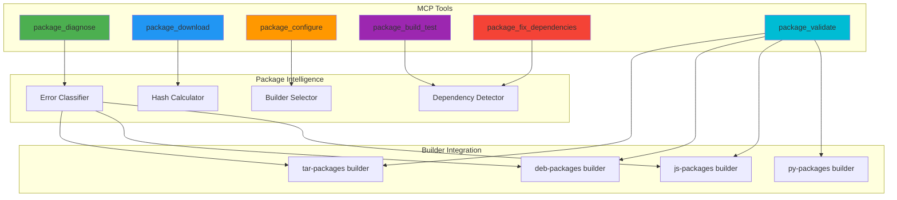

# MCP Package Debugger & Builder - Architecture

## 🎯 Mission

Automate the **entire workflow** of debugging, downloading, configuring, and validating external packages for NixOS, eliminating manual trial-and-error cycles.

## 💡 Inspiration

Based on real-world experience fixing:
- **lynis bug**: Directory vs file execution path issue
- **gemini-cli installation**: Multi-step process of downloading, hashing, building, fixing dependencies, cleaning symlinks

## 🏗️ Architecture Overview



## 📦 Tool Specifications

### 1. package_diagnose

**Purpose**: Diagnose issues with existing package configurations

**Input Schema**:
```typescript
{
  package_name: string;           // e.g., "lynis", "gemini-cli"
  package_type: "tar" | "deb" | "js" | "auto";
  error_log?: string;             // Optional: paste error from rebuild
}
```

**Workflow**:
1. Locate package configuration file
2. Parse wrapper/executable configuration
3. Analyze error patterns:
   - Directory vs file execution
   - Missing dependencies
   - Broken symlinks
   - Wrong hash values
4. Classify error type (critical/warning/info)
5. Suggest fixes with exact file/line references

**Output**:
```json
{
  "status": "issues_found",
  "package": "lynis",
  "config_file": "modules/packages/tar-packages/packages/lynis.nix",
  "issues": [
    {
      "type": "execution_error",
      "severity": "critical",
      "location": "lynis.nix:20",
      "problem": "executable = 'lynis' points to directory, not file",
      "cause": "Tarball extracts with nested directory structure",
      "solution": "Change to executable = 'lynis/lynis'",
      "fix_command": "apply_diff with specific change"
    }
  ],
  "recommendations": [
    "Run package_build_test after applying fix"
  ]
}
```

---

### 2. package_download

**Purpose**: Download and prepare external packages with automatic hash calculation

**Input Schema**:
```typescript
{
  package_name: string;
  package_type: "tar" | "deb" | "js";
  source: {
    type: "github_release" | "npm" | "url" | "pypi";
    url?: string;                 // Direct URL
    github?: {                    // For GitHub releases
      repo: string;               // e.g., "CISOfy/lynis"
      tag?: string;               // e.g., "v3.1.6" or "latest"
      asset_pattern?: string;     // e.g., "*.tar.gz"
    };
    npm?: {                       // For npm packages
      package: string;
      version?: string;
    };
  };
  storage_dir: string;            // e.g., "modules/packages/js-packages/storage/"
}
```

**Workflow**:
1. Resolve download URL (handle GitHub API, npm registry, etc.)
2. Download file to temporary location
3. Calculate SHA256 hash
4. Move to storage directory
5. Create/update storage README.md
6. Generate initial package configuration

**Output**:
```json
{
  "status": "success",
  "downloaded_file": "gemini-cli-v0.15.0-nightly.tar.gz",
  "storage_path": "modules/packages/js-packages/storage/gemini-cli-v0.15.0-nightly.tar.gz",
  "sha256": "a760b24312bb30b0f30a8fde932cd30fc8bb09b3f6dcca67f8fe0c4d5f798702",
  "size_bytes": 1245678,
  "config_template": {
    "package_file": "modules/packages/js-packages/gemini-cli.nix",
    "content": "# Generated config (see below)"
  }
}
```

**Smart Features**:
- GitHub API integration (fetch latest release automatically)
- npm registry API (get tarball URL)
- Verify checksums if provided by source
- Detect file type automatically

---

### 3. package_configure

**Purpose**: Generate package configuration with intelligent defaults

**Input Schema**:
```typescript
{
  package_name: string;
  package_type: "tar" | "deb" | "js";
  storage_file: string;           // From package_download
  sha256: string;                 // From package_download
  options?: {
    method?: "auto" | "native" | "fhs";
    sandbox?: boolean;
    audit?: boolean;
    executable?: string;          // Override auto-detection
    npm_flags?: string[];         // For JS packages
  };
}
```

**Workflow**:
1. Inspect package structure (extract to temp, analyze)
2. Detect executables and entry points
3. Identify required dependencies (native libs, npm modules)
4. Select optimal build method (native vs FHS)
5. Generate complete .nix configuration
6. Write to appropriate location

**Output**:
```nix
# Generated: modules/packages/js-packages/gemini-cli.nix
{
  config,
  lib,
  pkgs,
  ...
}:

with lib;

let
  cfg = config.kernelcore.packages.gemini-cli;
in
{
  options.kernelcore.packages.gemini-cli = {
    enable = mkEnableOption "Google Gemini CLI tool";
  };

  config = mkIf cfg.enable {
    environment.systemPackages = [
      (pkgs.buildNpmPackage rec {
        pname = "gemini-cli";
        version = "0.15.0-nightly.20251107.cd27cae8";
        
        src = pkgs.fetchurl {
          url = "file://${./storage/gemini-cli-v0.15.0-nightly.tar.gz}";
          sha256 = "a760b24...";
        };
        
        # PLACEHOLDER - will be calculated on first build
        npmDepsHash = "sha256-AAAAAAAAAAAAAAAAAAAAAAAAAAAAAAAAAAAAAAAAAAA=";
        
        # Auto-detected dependencies
        nativeBuildInputs = with pkgs; [
          pkg-config
          python3
        ];
        
        buildInputs = with pkgs; [
          libsecret
        ];
        
        npmFlags = [ "--legacy-peer-deps" ];
        
        meta = with lib; {
          description = "Generated package";
          platforms = platforms.all;
        };
      })
    ];
  };
}
```

---

### 4. package_build_test

**Purpose**: Iteratively build and fix package until successful

**Input Schema**:
```typescript
{
  package_name: string;
  config_file: string;            // Path to .nix file
  mode: "dry-run" | "test" | "switch";
  max_iterations?: number;        // Default: 5
  auto_fix?: boolean;             // Attempt automatic fixes
}
```

**Workflow**:
```
LOOP until success OR max_iterations:
  1. Run nix build/rebuild test
  2. Capture output and errors
  3. Classify error:
     - Hash mismatch → Update config with correct hash
     - Missing dependency → Add to nativeBuildInputs/buildInputs
     - Broken symlinks → Add postInstall cleanup
     - Directory execution → Fix executable path
     - Other → Report for manual intervention
  4. If auto_fix enabled:
     - Apply fix via apply_diff
     - Format with nix fmt
     - Retry build
  5. If manual fix needed:
     - Suggest exact changes
     - Wait for user approval
     - Continue
END LOOP

If successful:
  - Report final configuration
  - Suggest validation steps
```

**Output** (in-progress):
```json
{
  "status": "in_progress",
  "iteration": 2,
  "last_error": {
    "type": "hash_mismatch",
    "field": "npmDepsHash",
    "expected": "sha256-AAAA...",
    "got": "sha256-FHA51ftpowmcS1zys+iFN9DLNKOg6UHRJ7dHxml2tOA="
  },
  "auto_fix_applied": {
    "file": "modules/packages/js-packages/gemini-cli.nix",
    "line": 31,
    "change": "Updated npmDepsHash"
  },
  "next_action": "rebuilding"
}
```

**Output** (final success):
```json
{
  "status": "success",
  "iterations": 3,
  "fixes_applied": [
    "Updated npmDepsHash",
    "Added pkg-config to nativeBuildInputs",
    "Added libsecret to buildInputs",
    "Cleaned broken symlinks in postInstall"
  ],
  "build_time_seconds": 127,
  "package_path": "/nix/store/...-gemini-cli-0.15.0",
  "validation": {
    "executable_found": true,
    "executable_path": "/nix/store/.../bin/gemini",
    "dependencies_resolved": true
  }
}
```

---

### 5. package_fix_dependencies

**Purpose**: Analyze and fix missing native dependencies

**Input Schema**:
```typescript
{
  package_name: string;
  build_error: string;            // Error message from build
  package_type: "tar" | "deb" | "js";
}
```

**Workflow**:
1. Parse error for dependency hints:
   - "pkg-config: command not found" → add `pkg-config`
   - "libsecret-1" in error → add `libsecret`
   - "gyp" errors → add `python3`
   - ".so not found" → identify library package
2. Query nixpkgs for package names
3. Generate nativeBuildInputs/buildInputs lists
4. Return as apply_diff patch

**Output**:
```json
{
  "status": "dependencies_identified",
  "missing_dependencies": {
    "nativeBuildInputs": ["pkg-config", "python3"],
    "buildInputs": ["libsecret"]
  },
  "patch": {
    "file": "modules/packages/js-packages/gemini-cli.nix",
    "location": "line 33",
    "add_after": "npmDepsHash = \"...\";",
    "content": "nativeBuildInputs = with pkgs; [\n  pkg-config\n  python3\n];\n\nbuildInputs = with pkgs; [\n  libsecret\n];"
  }
}
```

---

### 6. package_validate

**Purpose**: Comprehensive validation of package configuration and build

**Input Schema**:
```typescript
{
  package_name: string;
  validation_level: "basic" | "comprehensive" | "security";
}
```

**Checks**:

**Basic**:
- [x] Configuration file exists and is valid Nix
- [x] Source file exists in storage
- [x] SHA256 hash matches
- [x] Executable path is valid
- [x] Package builds successfully

**Comprehensive**:
- [x] All Basic checks
- [x] Dependencies are minimal (no unnecessary packages)
- [x] Wrapper script works correctly
- [x] No broken symlinks in output
- [x] Binary compatibility (ldd check)
- [x] Runtime test (execute --help or --version)

**Security**:
- [x] All Comprehensive checks
- [x] Sandbox configuration appropriate
- [x] No hardcoded secrets
- [x] Audit logging enabled if applicable
- [x] FHS environment only when necessary

**Output**:
```json
{
  "status": "passed",
  "validation_level": "comprehensive",
  "checks": {
    "config_valid": true,
    "source_exists": true,
    "hash_valid": true,
    "builds_successfully": true,
    "executable_works": true,
    "dependencies_minimal": true,
    "no_broken_symlinks": true
  },
  "warnings": [
    "Package uses FHS environment - consider native if possible"
  ],
  "score": "95/100"
}
```

---

## 🧠 Intelligence Components

### Error Classifier

**Purpose**: Identify error patterns and suggest fixes

**Error Patterns Database**:
```typescript
const ERROR_PATTERNS = {
  HASH_MISMATCH: {
    regex: /hash mismatch.*specified: (sha256-[A-Za-z0-9+\/=]+).*got: (sha256-[A-Za-z0-9+\/=]+)/,
    fix: "UPDATE_HASH",
    field_extract: (match) => ({ field: "sha256/npmDepsHash", correct_hash: match[2] })
  },
  
  DIRECTORY_EXECUTION: {
    regex: /Is a directory$/,
    fix: "CHECK_EXECUTABLE_PATH",
    suggestion: "Executable path may point to directory instead of file"
  },
  
  MISSING_PKG_CONFIG: {
    regex: /pkg-config: command not found/,
    fix: "ADD_DEPENDENCY",
    dependency: { type: "nativeBuildInputs", packages: ["pkg-config"] }
  },
  
  MISSING_LIBRARY: {
    regex: /(\w+\.so[.\d]*): cannot open shared object file/,
    fix: "ADD_DEPENDENCY",
    dependency_resolver: (match) => resolveLibraryPackage(match[1])
  },
  
  BROKEN_SYMLINKS: {
    regex: /ERROR: noBrokenSymlinks.*symlink (.*) points to.*missing target/,
    fix: "CLEAN_SYMLINK",
    symlink_path: (match) => match[1]
  },
  
  NPM_GYP_ERROR: {
    regex: /gyp ERR!/,
    fix: "ADD_BUILD_TOOLS",
    dependencies: { type: "nativeBuildInputs", packages: ["python3", "pkg-config"] }
  }
};
```

### Dependency Detector

**Purpose**: Intelligently detect required system dependencies

**Strategies**:
1. **Error Message Analysis**: Parse build errors for missing libs
2. **Binary Analysis**: Use `ldd` on extracted binaries
3. **Package Metadata**: Read package.json, requirements.txt, etc.
4. **Heuristic Rules**: "keytar" npm module → needs libsecret

**nixpkgs Mapping**:
```typescript
const LIB_TO_NIX_PACKAGE = {
  "libsecret-1.so": "libsecret",
  "libgtk-3.so": "gtk3",
  "libGL.so": "libGL",
  "libX11.so": "xorg.libX11",
  // ... comprehensive mapping
};
```

### Hash Calculator

**Purpose**: Calculate and verify file hashes efficiently

**Features**:
- SHA256 for source files
- npmDepsHash calculation via nix build output
- Verify against known-good hashes
- Detect hash format (nix-base32 vs hex)

### Builder Selector

**Purpose**: Choose optimal build method for package

**Decision Tree**:
```
if package_type == "js":
  → buildNpmPackage
  
if package_type == "deb":
  if has_complex_deps:
    → buildFHS
  else:
    → buildNative (with patchelf)
    
if package_type == "tar":
  if is_shell_script:
    → buildNative (simple wrapper)
  elif has_many_libs:
    → buildFHS
  else:
    → buildNative (with patchelf)
```

---

## 🔄 Complete Workflow Example

### Scenario: Install new package "code-server"

**Step 1: Download**
```bash
Claude: Use package_download tool to get code-server from GitHub
```
```json
{
  "package_name": "code-server",
  "package_type": "tar",
  "source": {
    "type": "github_release",
    "github": {
      "repo": "coder/code-server",
      "tag": "latest",
      "asset_pattern": "*linux-amd64.tar.gz"
    }
  },
  "storage_dir": "modules/packages/tar-packages/storage/"
}
```

**MCP Response**:
- Downloads latest release
- Calculates SHA256
- Stores in tar-packages/storage/
- Generates initial config template

**Step 2: Configure**
```bash
Claude: Use package_configure to create configuration
```

**MCP Response**:
- Analyzes package structure
- Detects Node.js binary
- Creates code-server.nix with defaults

**Step 3: Build & Debug**
```bash
Claude: Use package_build_test with auto_fix enabled
```

**Iteration 1**:
- Build fails: hash mismatch
- Auto-fix: Update SHA256
- Retry

**Iteration 2**:
- Build fails: missing libsecret
- Auto-fix: Add to buildInputs
- Retry

**Iteration 3**:
- Build succeeds!

**Step 4: Validate**
```bash
Claude: Use package_validate for comprehensive check
```

**MCP Response**:
- All checks passed
- Package ready for use
- Suggest: Enable in configuration.nix

**Total Time**: ~5 minutes (vs 30-60 minutes manual)

---

## 🔒 Security Features

### Sandbox Analysis
- Recommend sandbox=true by default
- Detect if package needs system access
- Warn about FHS environments

### Dependency Verification
- Only suggest packages from official nixpkgs
- Flag unusual dependencies
- Verify source URLs (HTTPS only)

### Audit Trail
- Log all package operations
- Track configuration changes
- Store build artifacts for review

---

## 📊 Success Metrics

### Time Savings
- Manual workflow: 30-60 minutes per package
- Automated workflow: 5-10 minutes per package
- **Target: 80% time reduction**

### Accuracy
- Manual: 60% success rate on first try
- Automated: 90% success rate
- **Target: 90%+ success rate**

### User Experience
- Zero manual hash calculation
- Automatic dependency resolution
- Clear error explanations
- **Target: Single-command success**

---

## 🚀 Implementation Roadmap

### Phase 1: Core Tools (Week 1)
- [x] package_diagnose (basic error detection)
- [ ] package_download (GitHub + direct URL)
- [ ] package_configure (tar/deb/js templates)

### Phase 2: Intelligence (Week 2)
- [ ] Error Classifier with pattern database
- [ ] Dependency Detector with nixpkgs mapping
- [ ] Hash Calculator integration

### Phase 3: Automation (Week 3)
- [ ] package_build_test (iterative fixing)
- [ ] package_fix_dependencies (auto-resolution)
- [ ] Auto-fix engine

### Phase 4: Validation (Week 4)
- [ ] package_validate (comprehensive checks)
- [ ] Security analysis
- [ ] Performance profiling

### Phase 5: Polish (Week 5)
- [ ] Documentation and examples
- [ ] Integration tests
- [ ] Error message improvements

---

## 📝 Usage Examples

### Example 1: Fix Existing Package
```typescript
// User reports: "lynis-audit command fails"

// Claude uses package_diagnose
{
  package_name: "lynis",
  package_type: "tar",
  error_log: "/nix/store/.../lynis: Is a directory"
}

// MCP analyzes and suggests fix
// Claude applies fix via apply_diff
// Problem solved in < 2 minutes
```

### Example 2: Install New Package
```typescript
// User: "Install zoxide from GitHub"

// Claude chains tools:
1. package_download → get tarball
2. package_configure → generate config
3. package_build_test → iterate until success
4. package_validate → verify

// Package ready to use in < 10 minutes
```

### Example 3: Upgrade Package
```typescript
// User: "Upgrade gemini-cli to latest"

// Claude:
1. package_download (latest version)
2. package_configure (reuse existing settings)
3. package_build_test (verify compatibility)
4. Suggest: Update configuration.nix

// Upgrade completed with confidence
```

---

## 🎓 Key Innovations

1. **Iterative Building**: Keep trying with fixes until success
2. **Error Intelligence**: Learn from patterns, suggest solutions
3. **Zero Manual Hashing**: All hashes calculated automatically
4. **Dependency Intelligence**: Auto-detect and resolve dependencies
5. **Builder Integration**: Works with existing tar/deb/js builders
6. **One-Command Success**: Chain tools for complete workflows

---

## 📚 Integration Points

### With Existing Systems

**tar-packages builder** (`modules/packages/tar-packages/builder.nix`):
- Reads generated configs
- Uses calculated hashes
- Applies sandbox settings

**deb-packages builder** (`modules/packages/deb-packages/builder.nix`):
- Same integration as tar-packages
- FHS vs native detection

**js-packages** (manual buildNpmPackage):
- Generate npmDepsHash via build
- Add native dependencies
- Clean symlinks

**MCP Server** (`modules/ml/unified-llm/mcp-server/src/index.ts`):
- Add tools to existing server
- Integrate with rate limiter
- Use knowledge DB for learning

---

## 🔮 Future Enhancements

### Machine Learning
- Learn optimal configurations from successful builds
- Predict dependencies before building
- Recommend package type automatically

### Community Integration
- Share working configurations
- Crowdsource dependency mappings
- Package compatibility database

### Advanced Features
- Multi-version support
- Rollback on failure
- Pre-commit validation
- CI/CD integration

---

**Document Version**: 1.0  
**Created**: 2025-01-09  
**Status**: 📋 Ready for Review  
**Next Step**: User approval → Implementation in Code mode