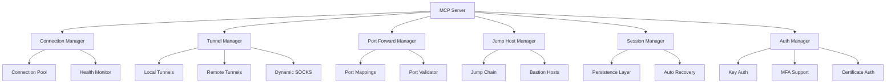

# SSH Advanced Tools Architecture

## 📋 Executive Summary

This document outlines the architecture for advanced SSH tools in the SecureLLM Bridge MCP server. These tools provide enterprise-grade remote server management capabilities including SSH tunneling, port forwarding, proxy jumps, multi-factor authentication, and session persistence.

### Current State
- Basic SSH connection management with ssh2 library
- Simple command execution with whitelisting
- Basic SFTP file transfers
- Maintenance checks framework

### Target State  
- Advanced SSH tunneling (local, remote, dynamic)
- Port forwarding with full control
- Proxy jump/bastion host support
- Multi-connection management with pooling
- MFA authentication support
- Session persistence and recovery
- Enterprise security controls

---

## 🏗️ Architecture Overview



---

## 🔐 Security Model

### Authentication Layers
1. **Primary Authentication**
   - SSH key-based (preferred)
   - Password (discouraged, time-limited)
   - Certificate-based authentication

2. **Multi-Factor Authentication**
   - TOTP (Time-based One-Time Password)
   - Hardware tokens (YubiKey, etc.)
   - SMS/Email backup codes

3. **Authorization**
   - Host whitelist (mandatory)
   - Command whitelist (per-connection)
   - Resource limits (connections, bandwidth)

### Security Controls
- **Connection Whitelisting**: Only pre-approved hosts
- **Command Sanitization**: Input validation and escaping
- **Rate Limiting**: Prevent brute force attacks
- **Audit Logging**: All operations logged
- **Timeout Management**: Automatic connection cleanup
- **Encryption**: All traffic over SSH protocol

---

## 🔧 Component Design

### 1. Enhanced Connection Manager

**Location**: `src/tools/ssh/connection-manager.ts`

**Responsibilities**:
- Manage connection lifecycle
- Connection pooling and reuse
- Health monitoring
- Auto-reconnection

**New Methods**:
```typescript
class SSHConnectionManager {
  // Pool management
  async getOrCreateConnection(config: SSHConfig): Promise<Connection>
  async releaseConnection(id: string): Promise<void>
  async pruneIdleConnections(maxIdleTime: number): Promise<number>
  
  // Health monitoring
  async healthCheck(id: string): Promise<HealthStatus>
  async monitorAll(): Promise<Map<string, HealthStatus>>
  
  // MFA support
  async connectWithMFA(config: SSHConfig, mfaCode: string): Promise<Connection>
  
  // Session persistence
  async saveSession(id: string): Promise<SessionData>
  async restoreSession(data: SessionData): Promise<Connection>
}
```

### 2. SSH Tunnel Manager

**Location**: `src/tools/ssh/tunnel-manager.ts`

**Responsibilities**:
- Create and manage SSH tunnels
- Local, remote, and dynamic forwarding
- Tunnel lifecycle management

**Features**:
```typescript
interface TunnelConfig {
  type: 'local' | 'remote' | 'dynamic';
  connection_id: string;
  
  // Local tunnel: -L localPort:remoteHost:remotePort
  local_port?: number;
  remote_host?: string;
  remote_port?: number;
  
  // Remote tunnel: -R remotePort:localHost:localPort
  local_host?: string;
  
  // Dynamic tunnel: -D socksPort
  socks_port?: number;
  
  // Options
  bind_address?: string;
  keep_alive?: boolean;
  timeout_seconds?: number;
}

class SSHTunnelManager {
  async createTunnel(config: TunnelConfig): Promise<TunnelResult>
  async listTunnels(connection_id?: string): Promise<TunnelInfo[]>
  async closeTunnel(tunnel_id: string): Promise<void>
  async getTunnelStatus(tunnel_id: string): Promise<TunnelStatus>
  
  // Monitoring
  async monitorTunnel(tunnel_id: string): Promise<TunnelMetrics>
  async autoReconnectTunnel(tunnel_id: string): Promise<void>
}
```

### 3. Port Forward Manager

**Location**: `src/tools/ssh/port-forward-manager.ts`

**Responsibilities**:
- Manage port forwarding rules
- Validate port availability
- Handle port conflicts

**Features**:
```typescript
interface PortForwardConfig {
  connection_id: string;
  forwards: Array<{
    local_port: number;
    remote_host: string;
    remote_port: number;
    protocol?: 'tcp' | 'udp';
  }>;
  auto_reconnect?: boolean;
}

class PortForwardManager {
  async setupForwards(config: PortForwardConfig): Promise<ForwardResult>
  async validatePorts(ports: number[]): Promise<ValidationResult>
  async getActiveForwards(connection_id?: string): Promise<ForwardInfo[]>
  async closeForward(forward_id: string): Promise<void>
  
  // Port management
  async findAvailablePort(range: [number, number]): Promise<number>
  async reservePort(port: number): Promise<boolean>
  async releasePort(port: number): Promise<void>
}
```

### 4. Jump Host Manager

**Location**: `src/tools/ssh/jump-host-manager.ts`

**Responsibilities**:
- Manage bastion/jump host chains
- Handle multi-hop connections
- Optimize connection paths

**Features**:
```typescript
interface JumpChainConfig {
  target: SSHConfig;
  jumps: SSHConfig[];
  strategy?: 'sequential' | 'optimal';
}

class JumpHostManager {
  async connectThroughJumps(config: JumpChainConfig): Promise<Connection>
  async addJumpHost(host: SSHConfig): Promise<void>
  async optimizeJumpPath(target: string): Promise<SSHConfig[]>
  
  // Chain management
  async validateJumpChain(jumps: SSHConfig[]): Promise<ValidationResult>
  async getJumpChainStatus(chain_id: string): Promise<ChainStatus>
  async closeJumpChain(chain_id: string): Promise<void>
}
```

### 5. Session Manager

**Location**: `src/tools/ssh/session-manager.ts`

**Responsibilities**:
- Session persistence across restarts
- Automatic session recovery
- Session state management

**Features**:
```typescript
interface SessionConfig {
  connection_id: string;
  persist: boolean;
  auto_recover: boolean;
  max_recovery_attempts?: number;
}

class SessionManager {
  async persistSession(config: SessionConfig): Promise<SessionData>
  async restoreSession(session_id: string): Promise<Connection>
  async listSessions(active_only?: boolean): Promise<SessionInfo[]>
  
  // Recovery
  async attemptRecovery(session_id: string): Promise<RecoveryResult>
  async cleanupExpiredSessions(): Promise<number>
  
  // State management
  async saveSessionState(session_id: string): Promise<void>
  async loadSessionState(session_id: string): Promise<SessionState>
}
```

---

## 📦 Type Definitions

### Extended Types (add to `src/types/extended-tools.ts`)

```typescript
// ===== SSH ADVANCED TYPES =====

export interface SSHTunnelArgs {
  type: 'local' | 'remote' | 'dynamic';
  connection_id: string;
  local_port?: number;
  remote_host?: string;
  remote_port?: number;
  local_host?: string;
  socks_port?: number;
  bind_address?: string;
  keep_alive?: boolean;
}

export interface SSHPortForwardArgs {
  connection_id: string;
  forwards: Array<{
    local_port: number;
    remote_host: string;
    remote_port: number;
    protocol?: 'tcp' | 'udp';
  }>;
  auto_reconnect?: boolean;
}

export interface SSHJumpHostArgs {
  target: SSHConnectArgs;
  jumps: SSHConnectArgs[];
  strategy?: 'sequential' | 'optimal';
}

export interface SSHSessionArgs {
  action: 'save' | 'restore' | 'list' | 'cleanup';
  session_id?: string;
  connection_id?: string;
  persist?: boolean;
  auto_recover?: boolean;
}

export interface SSHMFAArgs {
  connection_id: string;
  mfa_method: 'totp' | 'hardware' | 'sms';
  mfa_code: string;
}

export interface SSHConnectionPoolArgs {
  action: 'status' | 'prune' | 'stats';
  max_idle_time?: number;
  connection_id?: string;
}

// Result types
export interface TunnelResult extends ToolResult {
  data?: {
    tunnel_id: string;
    type: string;
    local_endpoint: string;
    remote_endpoint: string;
    status: 'active' | 'establishing' | 'failed';
  };
}

export interface JumpChainResult extends ToolResult {
  data?: {
    chain_id: string;
    target: string;
    jumps: string[];
    connection_id: string;
    total_latency_ms: number;
  };
}
```

---

## 🛠️ Tool Schemas

### 1. SSH Tunnel Tool
```typescript
export const sshTunnelSchema = {
  name: "ssh_tunnel",
  description: "Create SSH tunnel (local, remote, or dynamic SOCKS proxy)",
  inputSchema: {
    type: "object",
    properties: {
      type: {
        type: "string",
        enum: ["local", "remote", "dynamic"],
        description: "Tunnel type"
      },
      connection_id: {
        type: "string",
        description: "SSH connection ID"
      },
      local_port: {
        type: "number",
        description: "Local port (for local/dynamic tunnels)"
      },
      remote_host: {
        type: "string",
        description: "Remote host (for local tunnels)"
      },
      remote_port: {
        type: "number",
        description: "Remote port (for local/remote tunnels)"
      },
      socks_port: {
        type: "number",
        description: "SOCKS proxy port (for dynamic tunnels)"
      },
      keep_alive: {
        type: "boolean",
        description: "Keep tunnel alive with automatic reconnection"
      }
    },
    required: ["type", "connection_id"]
  }
};
```

### 2. SSH Port Forward Tool
```typescript
export const sshPortForwardSchema = {
  name: "ssh_port_forward",
  description: "Setup multiple port forwards through SSH connection",
  inputSchema: {
    type: "object",
    properties: {
      connection_id: {
        type: "string",
        description: "SSH connection ID"
      },
      forwards: {
        type: "array",
        items: {
          type: "object",
          properties: {
            local_port: { type: "number" },
            remote_host: { type: "string" },
            remote_port: { type: "number" },
            protocol: { type: "string", enum: ["tcp", "udp"] }
          },
          required: ["local_port", "remote_host", "remote_port"]
        }
      },
      auto_reconnect: {
        type: "boolean",
        description: "Auto-reconnect if connection drops"
      }
    },
    required: ["connection_id", "forwards"]
  }
};
```

### 3. SSH Jump Host Tool
```typescript
export const sshJumpHostSchema = {
  name: "ssh_jump_host",
  description: "Connect through bastion/jump hosts to reach target server",
  inputSchema: {
    type: "object",
    properties: {
      target: {
        type: "object",
        description: "Target server configuration"
      },
      jumps: {
        type: "array",
        items: { type: "object" },
        description: "Array of jump host configurations"
      },
      strategy: {
        type: "string",
        enum: ["sequential", "optimal"],
        description: "Connection strategy"
      }
    },
    required: ["target", "jumps"]
  }
};
```

### 4. SSH Session Manager Tool
```typescript
export const sshSessionSchema = {
  name: "ssh_session_manager",
  description: "Manage persistent SSH sessions with auto-recovery",
  inputSchema: {
    type: "object",
    properties: {
      action: {
        type: "string",
        enum: ["save", "restore", "list", "cleanup"],
        description: "Session action"
      },
      session_id: {
        type: "string",
        description: "Session ID (for restore action)"
      },
      connection_id: {
        type: "string",
        description: "Connection ID (for save action)"
      },
      persist: {
        type: "boolean",
        description: "Persist session across restarts"
      },
      auto_recover: {
        type: "boolean",
        description: "Enable automatic recovery"
      }
    },
    required: ["action"]
  }
};
```

### 5. SSH Connection Pool Tool
```typescript
export const sshConnectionPoolSchema = {
  name: "ssh_connection_pool",
  description: "Manage SSH connection pool and monitor health",
  inputSchema: {
    type: "object",
    properties: {
      action: {
        type: "string",
        enum: ["status", "prune", "stats"],
        description: "Pool management action"
      },
      max_idle_time: {
        type: "number",
        description: "Max idle time in seconds for pruning"
      },
      connection_id: {
        type: "string",
        description: "Specific connection ID (optional)"
      }
    },
    required: ["action"]
  }
};
```

---

## 🔄 Integration Points

### Main Server Integration (`src/index.ts`)

```typescript
// Import new SSH tools
import {
  SSHTunnelManager, sshTunnelSchema,
  SSHPortForwardManager, sshPortForwardSchema,
  SSHJumpHostManager, sshJumpHostSchema,
  SSHSessionManager, sshSessionSchema,
  SSHConnectionPoolManager, sshConnectionPoolSchema
} from './tools/ssh/index.js';

// Initialize managers
private tunnelManager!: SSHTunnelManager;
private portForwardManager!: SSHPortForwardManager;
private jumpHostManager!: SSHJumpHostManager;
private sessionManager!: SSHSessionManager;
private poolManager!: SSHConnectionPoolManager;

// In constructor
this.tunnelManager = new SSHTunnelManager();
this.portForwardManager = new SSHPortForwardManager();
this.jumpHostManager = new SSHJumpHostManager();
this.sessionManager = new SSHSessionManager();
this.poolManager = new SSHConnectionPoolManager();

// Add to tools list
{
  name: "ssh_tunnel",
  description: "Create SSH tunnel (local, remote, or dynamic SOCKS proxy)",
  inputSchema: sshTunnelSchema.inputSchema
},
// ... other new tools
```

---

## 📊 Monitoring & Metrics

### Connection Metrics
- Active connections count
- Connection success/failure rate
- Average connection time
- Bandwidth usage per connection

### Tunnel Metrics
- Active tunnels count
- Tunnel uptime
- Data transferred
- Reconnection events

### Security Metrics
- Failed authentication attempts
- MFA success rate
- Command rejections (whitelist violations)
- Connection source IPs

---

## 🧪 Testing Strategy

### Unit Tests
- Connection manager lifecycle
- Tunnel creation/teardown
- Port validation logic
- Session persistence/recovery
- MFA flow simulation

### Integration Tests  
- End-to-end tunnel creation
- Jump host chain connectivity
- Session recovery after disconnect
- Port forward reliability

### Security Tests
- Authentication bypass attempts
- Command injection tests
- Whitelist bypass attempts
- Resource exhaustion tests

---

## 📝 Implementation Phases

### Phase 1: Foundation (Week 1)
- [ ] Enhanced connection manager with pooling
- [ ] Basic tunnel manager (local forwarding)
- [ ] Extended type definitions
- [ ] Unit tests for core components

### Phase 2: Advanced Features (Week 2)
- [ ] Remote and dynamic tunneling
- [ ] Port forward manager
- [ ] Jump host support
- [ ] Integration tests

### Phase 3: Persistence & Recovery (Week 3)
- [ ] Session manager with persistence
- [ ] Auto-recovery mechanisms
- [ ] Health monitoring
- [ ] Load testing

### Phase 4: Security & Polish (Week 4)
- [ ] MFA authentication support
- [ ] Comprehensive audit logging
- [ ] Security hardening
- [ ] Documentation & examples

---

## 🔒 Security Considerations

### Critical Controls
1. **Host Whitelisting**: MANDATORY - No connections to non-whitelisted hosts
2. **Command Sanitization**: All commands validated and escaped
3. **Rate Limiting**: Prevent brute force and DoS attacks
4. **Session Timeouts**: Automatic cleanup of idle connections
5. **Audit Logging**: All operations logged with timestamps

### Best Practices
- Use SSH keys instead of passwords
- Enable MFA for production environments
- Rotate credentials regularly
- Monitor for suspicious activity
- Implement connection limits per user
- Use jump hosts for production access
- Enable session recording for compliance

---

## 📚 Usage Examples

### Example 1: Local Port Forward
```typescript
// Connect to remote database through SSH tunnel
const tunnel = await mcp.callTool('ssh_tunnel', {
  type: 'local',
  connection_id: 'conn-123',
  local_port: 5432,
  remote_host: 'db.internal.example.com',
  remote_port: 5432,
  keep_alive: true
});

// Now connect to localhost:5432 to access remote database
```

### Example 2: Jump Host Chain
```typescript
// Connect to private server through bastion
const connection = await mcp.callTool('ssh_jump_host', {
  target: {
    host: '10.0.1.50',
    username: 'admin',
    auth_method: 'key',
    key_path: '~/.ssh/id_rsa'
  },
  jumps: [
    {
      host: 'bastion.example.com',
      username: 'jumpuser',
      auth_method: 'key',
      key_path: '~/.ssh/jump_key'
    }
  ],
  strategy: 'optimal'
});
```

### Example 3: Dynamic SOCKS Proxy
```typescript
// Create SOCKS proxy for browser traffic
const proxy = await mcp.callTool('ssh_tunnel', {
  type: 'dynamic',
  connection_id: 'conn-123',
  socks_port: 1080,
  keep_alive: true
});

// Configure browser to use SOCKS5 proxy at localhost:1080
```

### Example 4: Persistent Session
```typescript
// Save session for later recovery
const session = await mcp.callTool('ssh_session_manager', {
  action: 'save',
  connection_id: 'conn-123',
  persist: true,
  auto_recover: true
});

// Later, restore the session
const restored = await mcp.callTool('ssh_session_manager', {
  action: 'restore',
  session_id: session.data.session_id
});
```

---

## 🎯 Success Criteria

- [ ] All SSH advanced features implemented and tested
- [ ] Comprehensive security controls in place
- [ ] Documentation complete with examples
- [ ] Performance benchmarks met (< 100ms connection time)
- [ ] Zero security vulnerabilities in audit
- [ ] 100% test coverage for critical paths
- [ ] Production-ready error handling
- [ ] Monitoring and metrics integrated

---

## 📖 References

- SSH Protocol: RFC 4253, RFC 4254
- SSH2 Library: https://github.com/mscdex/ssh2
- MCP SDK: https://github.com/modelcontextprotocol/sdk
- Security Best Practices: NIST SP 800-115

---

**Document Version**: 1.0  
**Last Updated**: 2025-11-26  
**Status**: Architecture Planning Phase  
**Next Review**: Implementation Phase 1 Completion